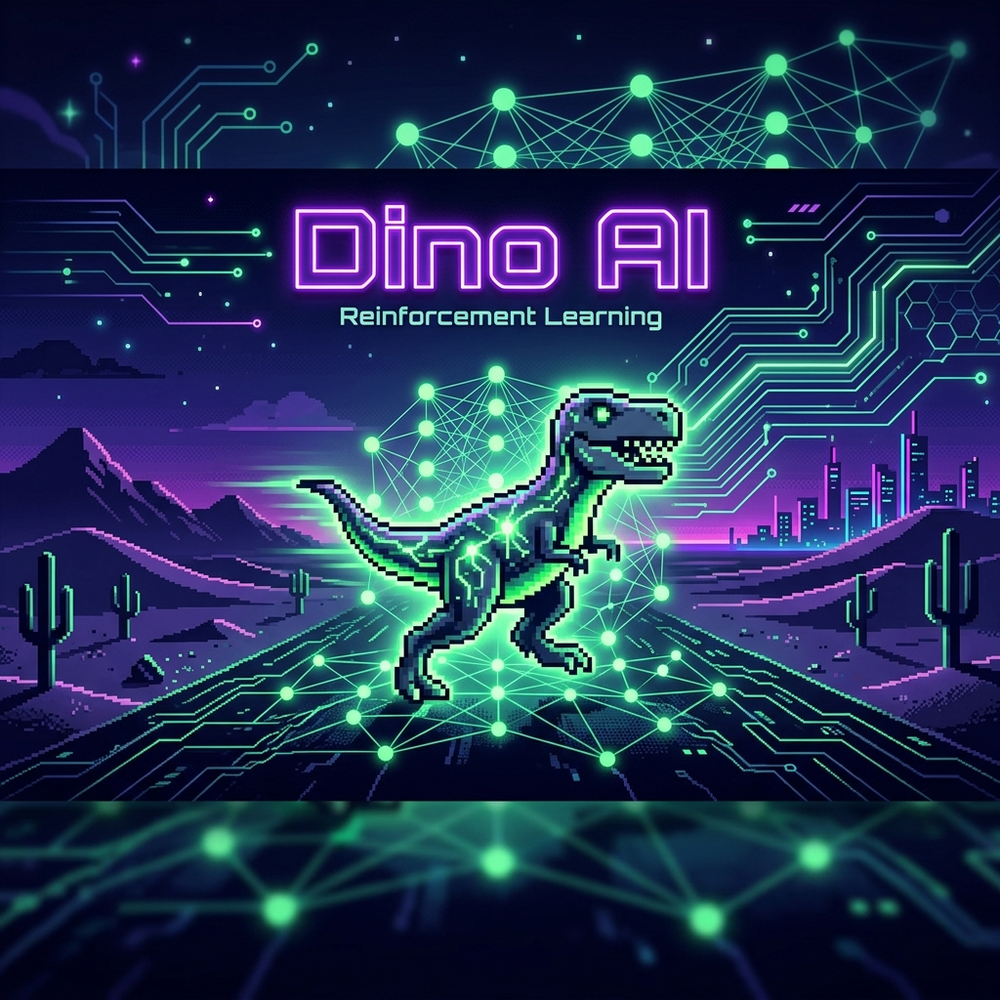

# 🦖 Dino AI: Neuroevolution in Action



[](https://processing.org/)
[](https://www.oracle.com/java/)
[](https://opensource.org/licenses/MIT)

An advanced implementation of **Neuroevolution** using the Processing framework. This project demonstrates how AI agents can learn to master the classic Chrome Dinosaur game through simulated evolution, combining neural networks with genetic algorithms.

---

## 📖 About the Project

The Chrome Dinosaur Game AI project is a sophisticated implementation of Neuroevolution, a subfield of artificial intelligence that bridges the gap between neural networks and genetic algorithms. Developed using the Processing framework in Java, this project transforms the iconic "No Internet" side-scroller into a high-speed laboratory for evolutionary computation. Instead of manually coding rules for jumping or crouching, the system cultivates intelligence through simulated natural selection.

At its core, the project manages a population of 100 autonomous agents, each controlled by a unique Feedforward Neural Network. These "brains" receive sensory inputs representing the game's state—such as obstacle distance, speed, and dimensions—and output decisions in real-time. Initially, the population exhibits random, chaotic behavior. However, through the application of Genetic Algorithms, the simulation identifies the most successful individuals based on their survival distance (fitness).

The evolutionary cycle is governed by three primary operators: Selection, Crossover, and Mutation. Top-performing "Elite" dinosaurs are preserved, while others are selected via tournament-style competition to reproduce. During crossover, the weights and biases of two successful networks are merged, potentially combining beneficial traits into superior offspring. Mutation introduces stochastic variations, allowing the population to explore new strategies and avoid local optima. Over dozens of generations, viewers can witness a remarkable transformation: the dinosaurs evolve from clumsy, random jumpers into masterful agents capable of dodging complex patterns of cacti and pterodactyls indefinitely.

Beyond its entertainment value, this project serves as a powerful educational tool for visualizing complex AI concepts. The real-time visualization layer provides deep insights into the neural network's internal state, highlighting active pathways and weight strengths as the AI processes information. It demonstrates the emergence of complex behaviors from simple evolutionary pressures, making it an ideal resource for students and developers interested in machine learning, game physics, and modular software design. By blending game development with advanced AI theory, this repository offers a transparent window into the mechanics of learning and adaptation in artificial systems.

---

## ✨ Key Features

| Feature | Description |
| :--- | :--- |
| **Neuroevolution** | Combines Neural Networks (Brains) with Genetic Algorithms (Evolution). |
| **Real-time Visualization** | Dynamic display of neural pathways, weights, and activation strengths. |
| **Advanced Physics** | Full recreation of the Chrome Dino physics, including gravity and variable speeds. |
| **Diverse Obstacles** | Includes multiple cactus types and height-varying bird obstacles. |
| **Detailed Analytics** | Live tracking of generations, fitness scores, and population health. |

---

## 🛠️ Neural Network Architecture

Each dinosaur's "brain" is a three-layer feedforward network:

- **Input Layer (7 Neurons)**:
  - 📏 Distance to next obstacle
  - 📍 Obstacle X & Y coordinates
  - 📐 Obstacle Width & Height
  - 🦖 Dino's vertical position
  - ⚡ Current game speed
- **Hidden Layer (7 Neurons)**:
  - Uses `tanh` activation for pattern recognition.
- **Output Layer (2 Neurons)**:
  - **Jump**: Activated if output > 0.48
  - **Crouch**: Activated if output > 0.55

---

## 🧬 The Evolutionary Loop

1. **Initialization**: Start with 100 dinosaurs with randomized weights.
2. **Evaluation**: Measure the "fitness" (survival time) of each agent.
3. **Selection**:
    - **Elitism**: Top 10% survive directly.
    - **Tournament**: Groups compete for breeding rights.
4. **Reproduction**:
    - **Crossover (70%)**: Mix genes from two parents.
    - **Clone (30%)**: Copy a successful parent directly.
5. **Mutation**: Apply small random shifts to weights to ensure genetic diversity.

---

## 🚀 Installation & Usage

### Prerequisites
- [Processing IDE 3.0+](https://processing.org/download/)
- Java 8 or higher

### Setup
1. **Clone the Repo**
   ```bash
   git clone https://github.com/Mujtabanite/Dino_Game_ReinforcementLearning_JAVA.git
   ```
2. **Launch Processing**
   - Open `main.pde` in the Processing IDE.
   - All associated `.pde` files will load automatically.
3. **Run**
   - Press `Ctrl + R` or click the **Run** button to start the evolution.

---

## ⚙️ Customization

You can fine-tune the evolution by modifying these variables in the code:

```java
int DINOS_PER_GENERATION = 100;  // Population size
float MUTATION_RATE = 0.25;       // Probability of weight mutation
float CROSSOVER_RATE = 0.7;       // Probability of genetic crossover
```

---

## 📄 License

This project is licensed under the **MIT License**. Feel free to use it for educational purposes and your own experiments!

---

*Made with ❤️ for AI Enthusiasts* 🦖🧬

